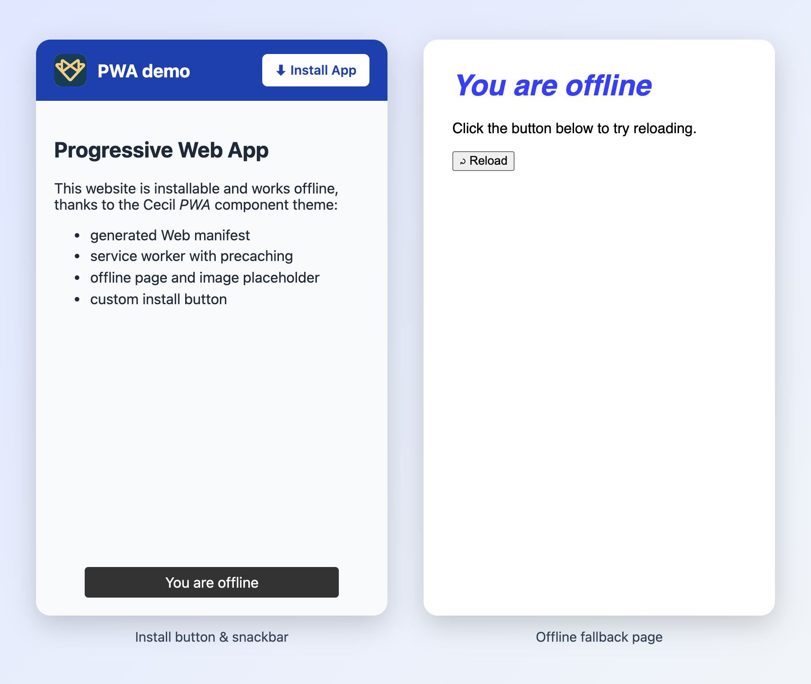

# PWA component theme

The _PWA_ component theme for [Cecil](https://cecil.app) provides helpers to implement a [Web manifest](https://developer.mozilla.org/docs/Web/Manifest) and a [service worker](https://developer.mozilla.org/docs/Web/API/Service_Worker_API) to turn a website into a [Progressive Web App](https://web.dev/explore/progressive-web-apps).



## Features

- Generated and configurable **Web manifest**
- Generated and configurable **service worker**
- **Automatic caching** of visited resources
- **No dependencies**, vanilla JavaScript
- **Precaching** of icons, assets and published pages
- **Offline support**: fallback page and image placeholder
- Custom **install button** support instead of browser prompt
- **Update notifications**: snackbar, app badge and system notification
- Menu entries as **app shortcuts**
- Translatable messages (English and French included)

## Prerequisites

- A [Cecil](https://cecil.app) website
- A [supported browser](https://caniuse.com/serviceworkers)
- HTTPS (or `localhost` during development)

## Installation

```bash
composer require cecil/theme-pwa
```

> Or [download the latest archive](https://github.com/Cecilapp/theme-pwa/releases/latest/) and uncompress its contents in `themes/pwa`.

## Usage

Add `pwa` in the `theme` section of the `config.yml`:

```yaml
theme:
  - pwa
```

Add the following line in the HTML `<head>` of the main template:

```twig
{{ include('partials/pwa.html.twig', {site}, with_context = false) }}
```

This partial adds the `theme-color` meta tag(s), the link to the Web manifest and the service worker registration script.

The theme generates the following files:

| File                    | Description                                   |
| ----------------------- | --------------------------------------------- |
| `/manifest.webmanifest` | Web manifest                                  |
| `/serviceworker.js`     | Service worker                                |
| `/offline.html`         | Fallback page displayed when offline          |

### Web manifest

Configure [Web manifest](https://developer.mozilla.org/docs/Web/Manifest) options:

```yaml
manifest:
  background_color: '#FFFFFF'
  theme_color: '#202020'
  icons:
    - icon-192x192.png
    - icon-512x512.png
    - src: icon-192x192-maskable.png
      purpose: maskable
    - src: icon-512x512-maskable.png
      purpose: maskable
```

> [!NOTE]
> You can specify a dark theme color with the `theme_color_dark` option.  
> The `icons` section is optional. If not provided, the theme generates a default set of icons (192 and 512 pixels, standard and maskable) from the `icon.png` file of the _assets_ directory of your website.

> [!TIP]
> Create your own [maskable icons](https://web.dev/articles/maskable-icon) with [Maskable.app](https://maskable.app/editor).

The following options are also available, with their default values:

```yaml
manifest:
  name: <site.title>
  short_name: <site.title> # truncated to 12 characters
  description: <site.description>
  display: standalone
  display_override: standalone
  start_url: <home page URL>
  id: <home page URL>
  orientation: any
  dir: ltr
```

#### Optional Web manifest settings

Add [shortcuts](https://developer.mozilla.org/docs/Web/Manifest/shortcuts) from the `main` menu entries (external links are ignored):

```yaml
manifest:
  shortcuts: true
```

> [!TIP]
> Shortcuts use the `icon-link.png` icon: add your own file with this name in the _assets_ directory to override it.

Provide [installer screenshots](https://developer.mozilla.org/docs/Web/Manifest/screenshots) (relative to the _assets_ directory):

```yaml
manifest:
  screenshots:
    - screenshots/desktop.png
    - screenshots/mobile.png
```

> [!NOTE]
> The `form_factor` is automatically set to `narrow` (portrait image) or `wide` (landscape image).

### Service worker

Enable the service worker:

```yaml
serviceworker:
  enabled: true
```

> [!IMPORTANT]
> The service worker is registered with the `/` scope.  
> If the service worker is disabled afterwards (`enabled: false`), it is automatically unregistered from the visitors browsers and their caches are deleted.

#### Optional service worker settings

Disable the browser install prompt and use a custom install button:

```yaml
serviceworker:
  install:
    prompt: false
    button: '#install-button' # query selector
```

```html
<button id="install-button" hidden>Install App</button>
```

> [!NOTE]
> The button must be hidden by default: it is displayed only when the browser allows the installation, and hidden again once the app is installed.

Icons defined in `manifest.icons` are precached by default. To disable this behavior:

```yaml
serviceworker:
  install:
    precache:
      icons: false
```

By default, all published pages are precached. To limit this number:

```yaml
serviceworker:
  install:
    precache:
      pages:
        limit: 10
```

Set the list of precached assets (relative to the _assets_ directory):

```yaml
serviceworker:
  install:
    precache:
      assets:
        - logo.png
```

Do not precache a specific page (through its front matter):

```yaml
---
serviceworker:
  precache: false
---
```

Define ignored paths (requests starting with these paths are never cached):

```yaml
serviceworker:
  ignore:
    - name: 'cms'
      path: '/admin'
```

Set the [cache mode](https://developer.mozilla.org/docs/Web/API/Request/cache) of requests stored by the service worker (`reload` by default, or `default`):

```yaml
serviceworker:
  cache:
    request: default
```

Notify the user when a new version of the website is available, through a snackbar, a badge on the app icon and/or a system notification:

```yaml
serviceworker:
  update:
    snackbar: true
    badge: true
    notification: true
```

> [!NOTE]
> Enabling `notification` asks the user for permission to display notifications.

Display a snackbar on connection loss:

```yaml
serviceworker:
  offline:
    snackbar: true
```

Use a custom offline page, by its ID (`offline` by default):

```yaml
serviceworker:
  offline:
    page: my-offline-page
```

> [!TIP]
> On a multilingual website, the offline page of the current language is used.

### Debug

When `debug: true` is set in the site configuration, the service worker logs its activity (installation, precaching, cache hits, etc.) in the browser console.

### Translations

Messages (snackbar, notification and offline page) are translatable. A French translation is included; add your own in the `translations` directory of your website (e.g.: `messages.de.yml`).

## License

The _PWA_ component theme is a free software distributed under the terms of the [MIT license](LICENSE).
